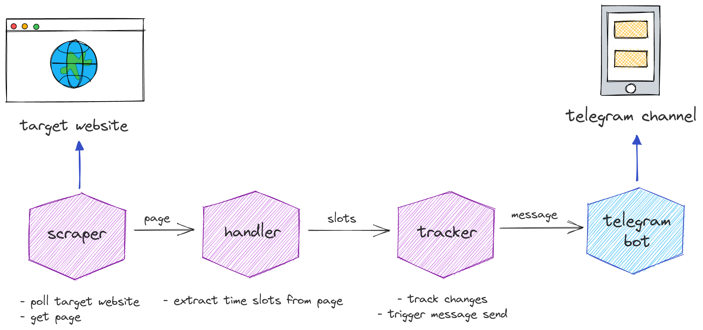

# Vertical Life Telegram bot

I needed a Telegram bot to notify me when somebody cancelled their booking at the gym. Here's the code. It is currently compatible with the [Vertical Life](https://www.vertical-life.info/) booking system and it is at the first stages of prototyping.

## Getting Started

### Dependencies
Please be sure that these dependencies are installed and at their last stable version
* python3
* pip
* venv
* Google Chrome (alternatively Chromium)
* a valid installation of [ChromeDriver](https://chromedriver.chromium.org)

### Installing

* clone the repository
* run `make` to install requirements (requires`venv` and `pip3`)
* `cp .env.exaple .end` to create a .env file. Fill the file as appropriate

### Executing program

* run `make run`

### Development

If you want to test new features in development mode, you can use the `make dev` command to enable autoreload of the program for the best development experience. Many thanks to @stevekrenzel for his Python [autoreload project](https://github.com/stevekrenzel/autoreload)

The architecture schema above shows what the pipeline looks like.
## Version History

* 0.1
    * Initial Release